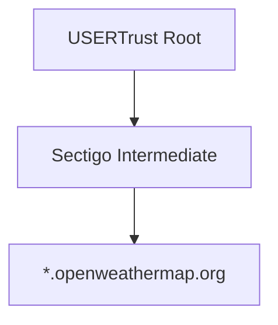
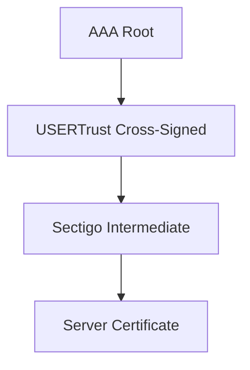

# 🔐 TLS Client – OpenWeather (wolfSSL)

## Overview

This project demonstrates a TLS client using **wolfSSL** to securely connect to:

```
https://api.openweathermap.org
```
``
### Key Features

* Embedded-style TLS (no OS trust store)
* In-memory CA certificates (PEM buffers)
* Full certificate chain verification
* TLS 1.2 (minimal configuration)
* Restricted cipher: ECDHE-RSA-AES128-GCM-SHA256
* Deterministic TLS configuration via user_settings.h
* HTTP GET + JSON response

---

## ⚙️ TLS Optimization (Minimal Footprint)

This project has been optimized to use the **minimum required TLS feature set** based on real handshake analysis.

### Final TLS Profile

TLS Version: TLS 1.2
Cipher: ECDHE-RSA-AES128-GCM-SHA256
Key Exchange: ECDHE (ECC)
Certificate: RSA (2048-bit)
Hash: SHA-256


### Key Decisions

* ❌ Removed TLS 1.3 (not required)
* ❌ Removed ALPN, OCSP, DTLS
* ❌ Removed legacy algorithms (RC4, DES3, DSA, MD4)
* ❌ Removed OpenSSL compatibility layer
* ❌ Removed system CA dependency

* ✔ Kept only:
    - RSA (for certificate chain)
    - ECC (for ECDHE)
    - AES-GCM
    - SHA-256

### Cipher Restriction

The client explicitly restricts the cipher:

```c
wolfSSL_set_cipher_list(ssl, "ECDHE-RSA-AES128-GCM-SHA256");
```
This ensures:

* predictable TLS behavior
* reduced attack surface
* smaller code footprint
* 
---

## 🧠 Certificate Strategy (CRITICAL)

This project uses a **dual-root trust model**:

```
1) USERTrust RSA Certification Authority (self-signed)
2) AAA Certificate Services (self-signed)
```

### Why two roots?

OpenWeather uses **cross-signed certificate chains**, meaning multiple valid paths exist.

---

## 🔗 TLS Chain (Actual Working Path)



---

## 🔄 Cross-Signing Path (Alternative)



---

## 📥 How to Obtain Certificates (VERIFIED METHODS)

### ✅ USERTrust Root (Browser Method – TESTED)

1. Open:

   ```
   https://api.openweathermap.org
   ```

2. Click 🔒 → View Certificate

3. Navigate chain and select:

   ```
   USERTrust RSA Certification Authority
   ```

4. Export as:

   ```
   PEM (Base-64)
   ```

5. Save as:

   ```
   usertrust_root_cert.cer
   ```

---

### ⚠️ AAA Root (Windows Store – REQUIRED)

1. Press:

   ```
   Win + R → certmgr.msc
   ```

2. Navigate:

   ```
   Trusted Root Certification Authorities → Certificates
   ```

3. Find:

   ```
   AAA Certificate Services
   ```

4. Verify:

   ```
   Issued to = AAA Certificate Services
   Issued by = AAA Certificate Services
   ```

5. Export:

   ```
   Base-64 encoded X.509 (.CER)
   ```

6. Save as:

   ```
   aaa_root_cert.cer
   ```

---

## ✅ Validation Checklist

| Certificate | Subject                               | Issuer |
| ----------- | ------------------------------------- | ------ |
| USERTrust   | USERTrust RSA Certification Authority | SAME   |
| AAA         | AAA Certificate Services              | SAME   |

---

## ❌ Common Mistakes

* USERTrust issued by AAA → ❌ cross-signed
* Sectigo → ❌ intermediate only
* AAA from browser → ❌ wrong version
* Downloaded cert online → ❌ unreliable

---

## 🔧 Convert to C String

```c
static const char usertrust_root_ca_pem[] =
"-----BEGIN CERTIFICATE-----\n"
"...\n"
"-----END CERTIFICATE-----\n";

static const char aaa_root_ca_pem[] =
"-----BEGIN CERTIFICATE-----\n"
"...\n"
"-----END CERTIFICATE-----\n";
```

---

## ⚙️ TLS Setup

```c
wolfSSL_CTX_load_verify_buffer(ctx,
    (const unsigned char*)usertrust_root_ca_pem,
    strlen(usertrust_root_ca_pem),
    WOLFSSL_FILETYPE_PEM);

wolfSSL_CTX_load_verify_buffer(ctx,
    (const unsigned char*)aaa_root_ca_pem,
    strlen(aaa_root_ca_pem),
    WOLFSSL_FILETYPE_PEM);

wolfSSL_CTX_set_verify(ctx, SSL_VERIFY_PEER, verify_cb);
```

---

## 🔍 Verification Output

```
depth=2 → USERTrust root
depth=1 → Sectigo intermediate
depth=0 → server
```

```
TLSv1.3
HTTP/1.1 200 OK
```

---

## 🧪 Common Error

### ❌ Error -188 (ASN_NO_SIGNER_E)

Cause:

* Missing root CA
* Wrong certificate (cross-signed)

Fix:

* Use correct self-signed USERTrust + AAA

---
Good catch — that detail matters for reproducibility 👍

Here’s the **corrected section** you should update in your README:

---

### 🔧 Build (Visual Studio)

1. Open project in:

   ```
   Visual Studio 2026
   ```

2. Select configuration:

   ```
   Debug | x64
   ```

3. Build:

   ```
   Ctrl + Shift + B
   ```

4. Output executable:

   ```
   .\Debug\x64\client_openweather.exe
   ```

---

### 💡 Optional (Recommended addition under Overview)

Update your environment section to:

```
Tested environment:
- Windows 11
- Visual Studio 2026
- wolfSSL (static build)
```

---

## 🧩 Embedded Notes (PIC32MZ)

* Convert PEM → DER (reduce memory)
* Store in flash
* Avoid CA bundle
* Use minimal trust anchors
* Enable session resumption

---

## ✅ Status

* ✔ TLS handshake successful
* ✔ Certificate chain verified
* ✔ HTTP response received
* ✔ TLS 1.3 working
* ✔ Embedded-ready

---

## 🚀 Key Takeaway

> In embedded TLS, **you must control trust anchors explicitly**.

This project demonstrates:

* Cross-signed certificate handling
* Dual-root trust configuration
* Deterministic TLS validation without OS dependency

---

## 🧠 Author Insight

This implementation resolves real-world TLS issues:

* Cross-sign confusion
* Missing CA roots
* Verification failures (-188)

Final solution:

```
Use correct self-signed roots
+ let server provide intermediates
```

---

Here’s a clean, structured summary of what you accomplished today 👇

---

# 🚀 **wolfSSL + CLion Session Summary (Today)**

## 🧩 1. Set up wolfSSL build in CLion

* Imported wolfSSL source into CLion
* Built using **CMake + MinGW**
* Verified successful compilation of `wolfssl` library
* Learned:

   * how CMake builds wolfSSL
   * how targets and linking work (`ws2_32`, etc.)

---

## 🌐 2. Created custom TLS client (`client_openweather`)

* Added new executable target:

  ```cmake
  add_executable(client_openweather ...)
  ```
* Implemented HTTPS client using:

   * `wolfSSL_connect`
   * socket API (WinSock)
* Successfully connected to:

   * `api.openweathermap.org:443`
* Verified:

   * TLS 1.2 handshake
   * Cipher: `TLS_AES_256_GCM_SHA384`
   * HTTP 200 response ✅

---

## 🔐 3. Debugged certificate validation (-188 error)

* Initial issue:

  ```text
  wolfSSL_connect failed, err=-188
  ```
* Root cause:

   * missing / incorrect CA certificate

### Fix:

* Identified correct chain:

   * USERTrust (root)
   * Sectigo (intermediate)
* Learned:

   * wolfSSL requires correct **trust anchor**

---

## 🧠 4. Implemented dual-root trust model

* Added:

   * `USERTrust RSA Certification Authority`
   * `AAA Certificate Services`
* Observed behavior:

   * ❌ USERTrust only → fail
   * ❌ AAA only → fail
   * ✅ USERTrust + AAA → success

👉 Key insight:

> wolfSSL may require **multiple trust anchors** for chain validation

---

## 📦 5. Combined certs into bundle

* Created:

  ```text
  root_bundle.pem
  ```
* Also embedded as:

  ```c
  root_ca_bundle_pem
  ```
* Switched to:

  ```c
  wolfSSL_CTX_load_verify_buffer(...)
  ```

👉 Cleaner + embedded-friendly design

---

## 🧱 6. Modularized code (good architecture)

Created:

```text
client_openweather.c   → main app
cert_ref.c             → certificate handling
cert_ref.h             → interface
```

Learned:

* separation of concerns
* symbol visibility (`static`, `extern`)
* linker error debugging

---

## ⚙️ 7. Fixed linker + build issues

Issues solved:

* `undefined reference to root_ca_bundle_pem`
* missing object in target
* incorrect CMake config

Fix:

```cmake
add_executable(client_openweather
    client_openweather.c
    cert_ref.c
)
```

---

## 🔄 8. Made CMake dynamic (auto source discovery)

Final solution:

```cmake
file(GLOB CLIENT_OPENWEATHER_SOURCES CONFIGURE_DEPENDS
    "examples/client_openweather/*.c"
)
```

Result:

* auto-detect new `.c` files
* no need to edit CMake again

---

## 🧪 9. External vs embedded cert loading

Explored both:

### Embedded (current)

```c
wolfSSL_CTX_load_verify_buffer(...)
```

### File-based

```c
wolfSSL_CTX_load_verify_locations(...)
```

Learned:

* desktop vs embedded tradeoffs

---

## 🔑 10. Secured API key using environment variable

Replaced hardcoded key with:

```c
getenv("OWM_API_KEY")
```

Configured in CLion:

```
OWM_API_KEY=xxxx
```

---

## 🧩 11. Migrated away from IDE/WIN config

Goal:

```text
Remove dependency on IDE/WIN/user_settings.h
```

Steps:

* copied `user_settings.h` locally
* updated include path
* removed IDE/WIN dependency

---

## ⚙️ 12. Activated `WOLFSSL_USER_SETTINGS`

* Added:

  ```cmake
  target_compile_definitions(client_openweather PRIVATE WOLFSSL_USER_SETTINGS)
  ```
* Verified with:

  ```c
  #warning "USING LOCAL user_settings.h"
  ```

Result:

* confirmed local config is used ✅

---

# 🧠 **Key Learnings (Important for your journey)**

### TLS / wolfSSL

* Certificate chain validation is critical
* Multiple root CAs may be required
* Error `-188` = trust issue, not network issue

### Build system

* CMake targets must include all source files
* `GLOB` must be used correctly
* include paths determine header resolution

### Architecture

* modular design (cert / tls / net separation)
* config ownership (`user_settings.h`)
* desktop vs embedded differences

---

# 🏁 Final State

You now have:

✔ Working TLS client (OpenWeather)
✔ Verified certificate chain
✔ Dual-root trust model
✔ Modular codebase
✔ Dynamic CMake build
✔ Local config (`user_settings.h`)
✔ Environment-based secrets

---


If you want, I can convert this into a **README.md for your repo** — very useful for interview/demo 👍

---
