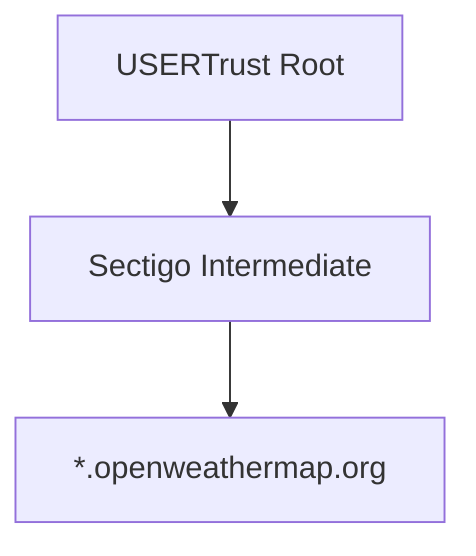
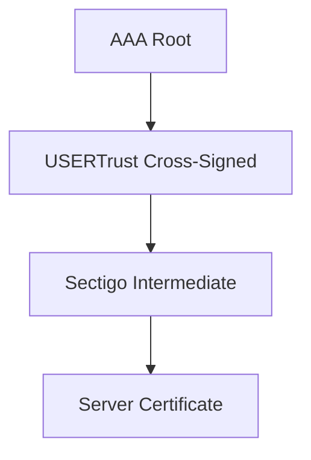

# 🔐 TLS Client – OpenWeather (wolfSSL)

## Overview

This project demonstrates a TLS client using **wolfSSL** to securely connect to:

```
https://api.openweathermap.org
```

### Key Features

* Embedded-style TLS (no OS trust store)
* In-memory CA certificates (PEM buffers)
* Full certificate chain verification
* TLS 1.3 handshake
* HTTP GET + JSON response

---

## 🧠 Certificate Strategy (CRITICAL)

This project uses a **dual-root trust model**:

```
1) USERTrust RSA Certification Authority (self-signed)
2) AAA Certificate Services (self-signed)
```

### Why two roots?

OpenWeather uses **cross-signed certificate chains**, meaning multiple valid paths exist.

---

## 🔗 TLS Chain (Actual Working Path)



---

## 🔄 Cross-Signing Path (Alternative)



---

## 📥 How to Obtain Certificates (VERIFIED METHODS)

### ✅ USERTrust Root (Browser Method – TESTED)

1. Open:

   ```
   https://api.openweathermap.org
   ```

2. Click 🔒 → View Certificate

3. Navigate chain and select:

   ```
   USERTrust RSA Certification Authority
   ```

4. Export as:

   ```
   PEM (Base-64)
   ```

5. Save as:

   ```
   usertrust_root_cert.cer
   ```

---

### ⚠️ AAA Root (Windows Store – REQUIRED)

1. Press:

   ```
   Win + R → certmgr.msc
   ```

2. Navigate:

   ```
   Trusted Root Certification Authorities → Certificates
   ```

3. Find:

   ```
   AAA Certificate Services
   ```

4. Verify:

   ```
   Issued to = AAA Certificate Services
   Issued by = AAA Certificate Services
   ```

5. Export:

   ```
   Base-64 encoded X.509 (.CER)
   ```

6. Save as:

   ```
   aaa_root_cert.cer
   ```

---

## ✅ Validation Checklist

| Certificate | Subject                               | Issuer |
| ----------- | ------------------------------------- | ------ |
| USERTrust   | USERTrust RSA Certification Authority | SAME   |
| AAA         | AAA Certificate Services              | SAME   |

---

## ❌ Common Mistakes

* USERTrust issued by AAA → ❌ cross-signed
* Sectigo → ❌ intermediate only
* AAA from browser → ❌ wrong version
* Downloaded cert online → ❌ unreliable

---

## 🔧 Convert to C String

```c
static const char usertrust_root_ca_pem[] =
"-----BEGIN CERTIFICATE-----\n"
"...\n"
"-----END CERTIFICATE-----\n";

static const char aaa_root_ca_pem[] =
"-----BEGIN CERTIFICATE-----\n"
"...\n"
"-----END CERTIFICATE-----\n";
```

---

## ⚙️ TLS Setup

```c
wolfSSL_CTX_load_verify_buffer(ctx,
    (const unsigned char*)usertrust_root_ca_pem,
    strlen(usertrust_root_ca_pem),
    WOLFSSL_FILETYPE_PEM);

wolfSSL_CTX_load_verify_buffer(ctx,
    (const unsigned char*)aaa_root_ca_pem,
    strlen(aaa_root_ca_pem),
    WOLFSSL_FILETYPE_PEM);

wolfSSL_CTX_set_verify(ctx, SSL_VERIFY_PEER, verify_cb);
```

---

## 🔍 Verification Output

```
depth=2 → USERTrust root
depth=1 → Sectigo intermediate
depth=0 → server
```

```
TLSv1.3
HTTP/1.1 200 OK
```

---

## 🧪 Common Error

### ❌ Error -188 (ASN_NO_SIGNER_E)

Cause:

* Missing root CA
* Wrong certificate (cross-signed)

Fix:

* Use correct self-signed USERTrust + AAA

---
Good catch — that detail matters for reproducibility 👍

Here’s the **corrected section** you should update in your README:

---

### 🔧 Build (Visual Studio)

1. Open project in:

   ```
   Visual Studio 2026
   ```

2. Select configuration:

   ```
   Debug | x64
   ```

3. Build:

   ```
   Ctrl + Shift + B
   ```

4. Output executable:

   ```
   .\Debug\x64\client_openweather.exe
   ```

---

### 💡 Optional (Recommended addition under Overview)

Update your environment section to:

```
Tested environment:
- Windows 11
- Visual Studio 2026
- wolfSSL (static build)
```

---

## 🧩 Embedded Notes (PIC32MZ)

* Convert PEM → DER (reduce memory)
* Store in flash
* Avoid CA bundle
* Use minimal trust anchors
* Enable session resumption

---

## ✅ Status

* ✔ TLS handshake successful
* ✔ Certificate chain verified
* ✔ HTTP response received
* ✔ TLS 1.3 working
* ✔ Embedded-ready

---

## 🚀 Key Takeaway

> In embedded TLS, **you must control trust anchors explicitly**.

This project demonstrates:

* Cross-signed certificate handling
* Dual-root trust configuration
* Deterministic TLS validation without OS dependency

---

## 🧠 Author Insight

This implementation resolves real-world TLS issues:

* Cross-sign confusion
* Missing CA roots
* Verification failures (-188)

Final solution:

```
Use correct self-signed roots
+ let server provide intermediates
```

---
